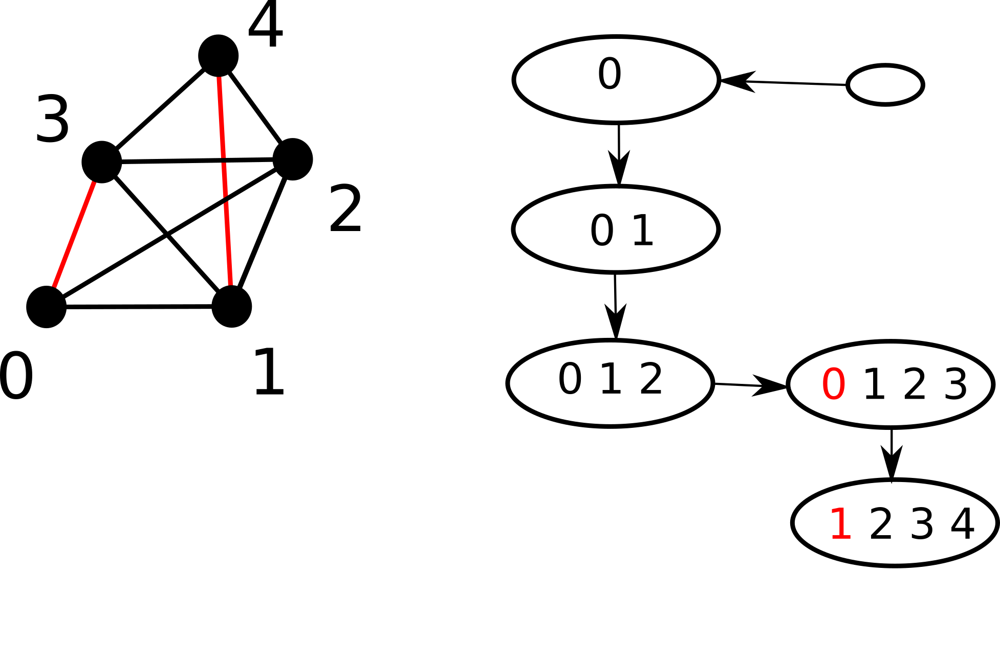

.. tree-diet documentation master file, created by
   sphinx-quickstart on Wed Apr 28 17:24:54 2021.
   You can adapt this file completely to your liking, but it should at least
   contain the root `toctree` directive.

Welcome to tree-diet's documentation!
=====================================

Documentation for the implementation of tree diet.
This code was used for the numerical experiments in
`This paper <https://hal.inria.fr/hal-03206132/>`_

    Simple example to illustrate the method: a  graph
    consisting of **4 vertices** and **9 edges** is defined. A **tree decomposition**
    of the graph, of **width 3**, is provided. When we call the tree-diet
    algorithm onto this example, asking for a **target width of 2**, 
    the algorithm returns that it is possible to **keep 7 edges** (the black
    ones on the figure). The two red ones have become **invisible**, or **unrealizable**
    given the constraint on the width.

.. code-block:: python

    from graph_classes import Graph, Bag
    from tree_diet import tree_diet
        
    # Graph Definition
    G = Graph()
     
    for i in range(5):
        G.add_vertex(i)

    G.add_edge(0,1)
    G.add_edge(0,2)
    G.add_edge(0,3)

    G.add_edge(1,2)
    G.add_edge(1,3)

    G.add_edge(2,3)

    G.add_edge(1,4)
    G.add_edge(2,4)
    G.add_edge(3,4)

    # Tree Decomposition construction
    R = Bag([])

    B1 = Bag([0])
    B2 = Bag([0,1])
    B3 = Bag([0,1,2])
    B4 = Bag([0,1,2,3])
    B5 = Bag([1,2,3,4])

    R.add_child(B1)
    B1.add_child(B2)
    B2.add_child(B3)
    B3.add_child(B4)
    B4.add_child(B5)

    # Calling Dynamic Programming tree-diet algorithm
    OPT, real_edges, color_dictionary = tree_diet(R, G.adj, 2, [])

    print(OPT,real_edges, color_dictionary)

The output should be:

.. code-block:: python

    >> 7, [(0, 1), (0, 2), (1, 2), (0, 3), (1, 3), (1, 4), (3, 4)], {1: {0: 1}, 2: {0: 1, 1: 1}, 3: {0: 1, 1: 1, 2: 1}, 4: {0: 1, 1: 1, 2: 3, 3: 1}, 5: {1: 1, 2: 3, 3: 1, 4: 1}}

This output means "7 edges are preserved when asking to slim the tree decomposition whose root is R down to a width of 2". The 
list of preserved edges is given by **real edges** while the color dictionary specifies which vertices to remove in order
to apply the diet to input tree decomposition.

.. autofunction:: tree_diet.tree_diet

.. autoclass:: graph_classes.Bag
    :special-members: __init__
    :members:
.. autoclass:: graph_classes.Graph
    :special-members: __init__
    :members:
